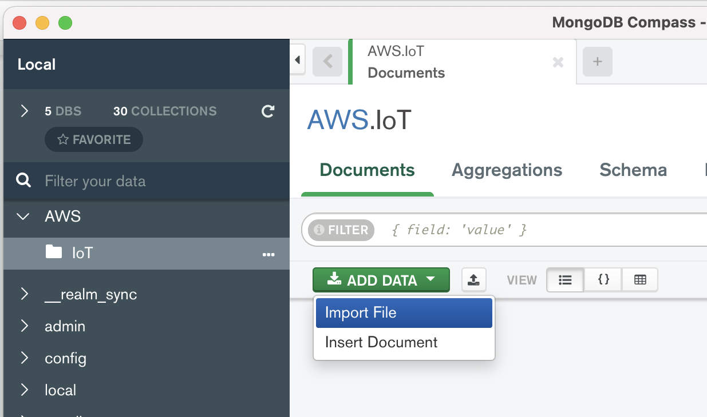
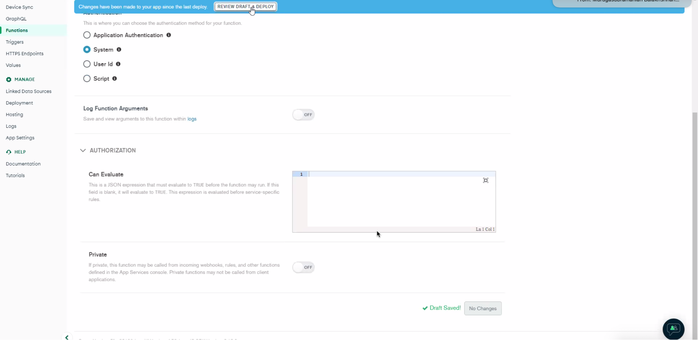

# AWS Hands On - IoT Use Case with MongoDB Atlas, Kinesis Data firehose, MongoDB Charts and Atlas Datalake


## Setup
This Demo will walk you through the MongoDB Atlas integration with Kinesis Data firehouse, MongoDB charts and Atlas Datalake.


### 1. Configure Atlas Environment
* Log-on to your Atlas account (using the MongoDB SA preallocated Atlas credits system) and navigate to your SA project
* In the project's Security tab, choose to add a new user called main_user, for this user select Atlas Admin Role from built in roles section (make a note of the password you specify)
* Create an M0 based 3 node replica-set in a single AWS region of your choice with default storage settings (backup can be disabled).


### 2. Configure MongoDB Compass:
* In Atlas go to Network Access section under security. In IP Access List whitelist the IP of system where you are running compass OR Allow access from anywhere. 
* Download MongoDB compass and install OR Open atlas and navigate to your cluster -> click on connect. Select “Connect using MongoDB Compass” and download the supported version on your machine from the dropdown.


* Copy the connection string, then open MongoDB Compass. Click on “connect to” and paste (Note : Update the connection URL with the <username> and <password> to the one generated in step 1) and Click on connect. 
* Download the file from here to loading the data to your collection.
* Create a database AWS and collection IoT.


* Click on ADD DATA and Import File.
* Import the JSON file to AWS.IoT .




### 3. Create Realm Web Application:
* Log into your MongoDB cloud account. If you do not have an account you can sign up for a free account.
* Click on the AppService tab. You will be having options to choose from templates. Instead click on “Build your own app”. 

 
* Choose the Database and Service name. Choose the App Deployment model and the preferred region


* Once confirmed the above parameters, click on “Create App Services”
* Create the EndPoints to  add an HTTP endpoint to external clients to call over HTTP services


* Click the start button

* Click on “Add an Endpoint”


* Add “/test” to the endpoint

* Select “Add a new function”


* Name the function as “testIoT” and copy the below code to the function
Code:
    ```
  exports = function(payload, response) {
  
    const decodeBase64 = (s) => {
        var e={},i,b=0,c,x,l=0,a,r='',w=String.fromCharCode,L=s.length
        var A="ABCDEFGHIJKLMNOPQRSTUVWXYZabcdefghijklmnopqrstuvwxyz0123456789+/"
        for(i=0;i<64;i++){e[A.charAt(i)]=i}
        for(x=0;x<L;x++){
            c=e[s.charAt(x)];b=(b<<6)+c;l+=6
            while(l>=8){((a=(b>>>(l-=8))&0xff)||(x<(L-2)))&&(r+=w(a))}
        }
        return r
    }
 
    
    var fullDocument = JSON.parse(payload.body.text());
    
    const firehoseAccessKey = payload.headers["X-Amz-Firehose-Access-Key"]
    console.log('should be: ' + context.values.get("KDFH_SECRET_KEY"));
 
   // Check shared secret is the same to validate Request source
   if (firehoseAccessKey == context.values.get("KDFH_SECRET_KEY")) {
 
      var collection = context.services.get("mongodb-atlas").db("AWS").collection("IoT");
      
      fullDocument.records.forEach((record) => {
            const document = JSON.parse(decodeBase64(record.data))
            const status = collection.insertOne(document);
            console.log("got status: "+ status)
      })
 
      response.setStatusCode(200)
            const s = JSON.stringify({
                requestId: payload.headers['X-Amz-Firehose-Request-Id'][0],
                timestamp: (new Date()).getTime()
            })
            response.addHeader(
                "Content-Type",
                "application/json"
            );
            response.setBody(s)
            console.log("response JSON:" + s)
      return
   } else {
    response.setStatusCode(500)
            response.setBody(JSON.stringify({
                requestId: payload.headers['X-Amz-Firehose-Request-Id'][0],
                timestamp: (new Date()).getTime(),
                errorMessage: "Error authenticating"
            }))
    return
   }
    };

  ```


* Click click “Save Draft”

* Click “next” to the information tab which details about the difference between “save” and “deploy”. Note this screen popsup only the first time.


* Now Review the code and deploy the application


* Ensure the deployment is successful

* Click on “Edit Function” by clicking the right mouse button

* Select the “Settings Tab”


* Choose the Authentication as “System” and click “Save Draft”. Ensure it is saved successfully.

* Perform the review and deployment one more time.




### 4. Configure AWS Environment
* Log into AWS Console and search for Kinesis.
* On the Kinesis Data Firehose console

* choose Create delivery stream. Select the source as “Direct PUT”. The Destination as “MongoDB Cloud” and Name the Delivery stream as “MongoDBIntegrationStream”

* Create the DataAPi in App Services and enter the DATA API Endpoint of the Application in AWS Kinesis Firehose Delivery Stream end point.


* For API Key, please enter a random value. Right now we are running it without configuring the API key. 
* For Content encoding, leave it as Disabled.
* For S3 backup mode, select Failed data only.
* For S3 bucket, enter the S3 bucket for delivery of log events that exceeded the retry duration. Alternatively, you can create a new bucket by choosing Create new.
* In the IAM role section, configure permissions for your delivery stream by choosing Create or update IAM role.
* For MongoDB buffer conditions, accept the default MongoDB and Amazon S3 buffer conditions for your stream.  Note that the buffer size should be a value between 1MiB and 16MiB.  Review the limits in MongoDB Atlas documentation.
* Review your settings and choose Create delivery stream.


## Execution
### To write a record to a stream

The following put-record example writes data to a stream. The data is encoded in Base64 format.

```
aws firehose put-record \
    --delivery-stream-name PUT-MNG-iemee \
    --record '{"Data":"SGVsbG8gd29ybGQ"}'
```

Output:

```
{
    "RecordId": "RjB5K/nnoGFHqwTsZlNd/TTqvjE8V5dsyXZTQn2JXrdpMTOwssyEb6nfC8fwf1whhwnItt4mvrn+gsqeK5jB7QjuLg283+Ps4Sz/j1Xujv31iDhnPdaLw4BOyM9Amv7PcCuB2079RuM0NhoakbyUymlwY8yt20G8X2420wu1jlFafhci4erAt7QhDEvpwuK8N1uOQ1EuaKZWxQHDzcG6tk1E49IPeD9k",
    "Encrypted": false
}

```

These records should be visible in MongoDB collection - AWS.IoT in few seconds. 


## Visualize Using MongoDB Charts

* Open atlas and navigate to charts and click on “Add data source”. Select the cluster, database and collection you want to create the charts for (In our case cluster0 -> AWS -> IoT) and click on “Finish”.

* Navigate to dashboards and click on “Add Dashboard”. Name your dashboard and click on save.

* Open the dashboard and click on “Add Chart”.


* Select the data source AWS.IoT from dropdown. Select chart type “Circular”. Drag and drop the fields city and reg_num to Label and Arc respectively.

* Click on the save button to view your chart on the dashboard.


## Online Archiving Based on Date
* Go to your cluster and click on the Online archive tab. Click on Add archive.

* Fill the Namespace, Date field with an index on it. Set the age limit to 50 and click on next.

* Finally Click on begin archiving.

* Click on data lake form side navigation bar. The Online data lake can be found here.

* To connect to the archive click on the <Cluster name> Archive and click on connect using MongoDB compass. Copy the URL and paste in your compass connect. Similarly copy the <Cluster name> Cluster Archive to connect to Archive+Atlas.
* Run the below query in compass.

```
db.IoT.find({"Timestamp" : { "$gte": ISODate("2021-10-06T05:51:11.000Z")},"reg_num": "KA1313"});


db.IoT.aggregate({"$match":{"reg_num": "KA7777"}},{"$group":{ _id: { $year: "$Timestamp"},"reg_num":{"$first":"$reg_num"}}},{"$count":"year_count"});
```


